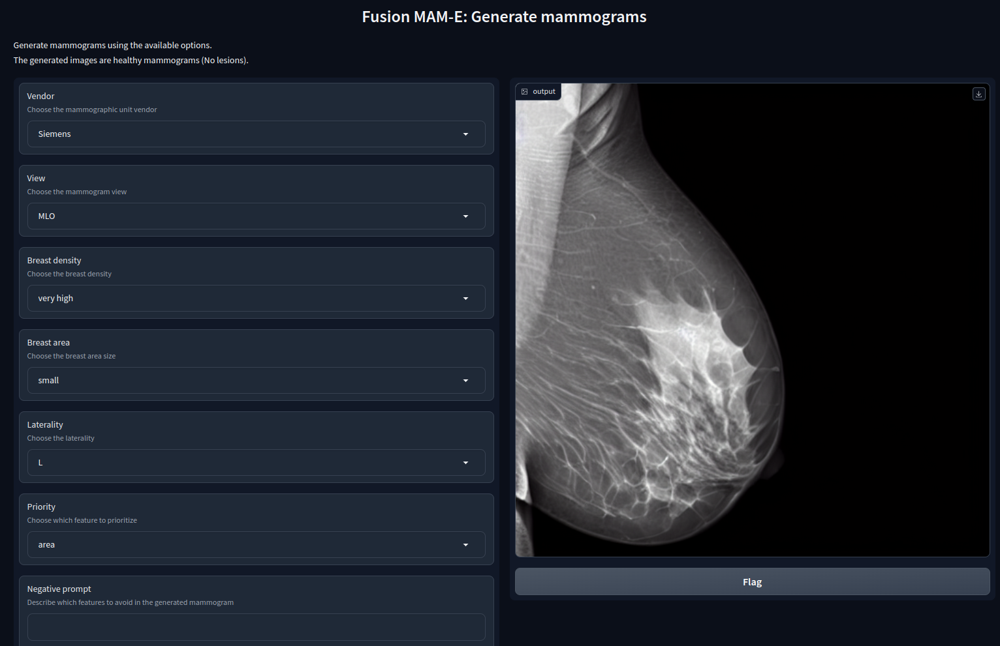

# MAM-E: Mammographic synthetic image generation with diffusion models

------------------------------------------------------------------------------------------------------------------------------
> ## Running GUI
>Access our GUI for the inference of the models [here](https://f07462107e6868080b.gradio.live/)!<br>
>>Note: The availability of the GUI is not guaranteed 24/7.

## Main contributors
- ### Ricardo Montoya-del-Angel
- ### Robert Martí

## Research group
- ### Computer Vision and Robotics Institute (ViCOROB) of the University of Girona (UdG)

------------------------------------------------------------------------------------------------------------------------------



This repository contains the code derived from the Master thesis project on mammographic image generation using diffusion models. This project is part of the final assessment to obtain the Joint Master's degree in Medical Imaging and Applications (MAIA) at the University of Girona (Spain), the University of Cassino and Southern Lazio (Italy) and the University of Bourgogne (France).

# Description
------------------------------------------------------------------------------------------------------------------------------
In this work, we propose exploring the use of diffusion models for the generation of high quality full-field digital mammograms using state-of-the-art conditional diffusion pipelines. Additionally, we propose using stable diffusion models for the inpainting of synthetic lesions on healthy mammograms. We introduce MAM-E, a pipeline of generative models for high quality mammography synthesis controlled by a text prompt and capable of generating synthetic lesions on specific sections of the breast.

# Main documentation
------------------------------------------------------------------------------------------------------------------------------
The report of the project, the slides of the presentation and the poster can be found in the [documentation](https://github.com/Likalto4/diffusion-models_master/tree/main/documentation) folder.

# Set up the environment
------------------------------------------------------------------------------------------------------------------------------
Two versions of the environment are provided. The first one is a conda environment which can be installed with:

```bash 
conda env create -f dreambooth.yml
conda activate dreambooth
```

Attention: several packages are not available in conda and need to be installed via pip.
The packages in question are mainly Hugging Face's and should be installed from source using:
    
```bash
pip install git+https://github.com/huggingface/transformers
```

Refer to the [Hugging Face documentation](https://huggingface.co/transformers/installation.html) for more information.

For a more clear insight of the specific pip packages needed, refer to the dreambooth_requirements.txt file.

# Repository structure
------------------------------------------------------------------------------------------------------------------------------

The repository is structured as follows:
- assessment: code for qualitative and quantitative assessment of the generated images.
- data (not included in the repository): contains the data used for training the models.
- dataset_analysis: code for the analysis of the dataset. This includes constructing the dataset metadata, saving png files, creating masks, prompt, etc.
- datasets_local: contains useful functions for the dataset creation.
- envs: contains the conda and pip environment files.
- experiments: contains the code for the main experiments. It is divided in several sections. The main ones are:: 
    - dreambooth: original code for the Dreambooth model.
    - inference: code for the inference of the models, including GradIO GUI implementations.
    - inpainting: for the inpainting experiments.
    - with_prompt: main SD and Dreambooth experiments.
- figures: contains the figures used in the README.
- generation (future work): for the use of synthetic images in the training of CAD systems.
- results (not included in the repository): contains the weights, pipeline configuration files and some logging files for the experiments. (The same information can be found in the Hugging Face repository of the first author).