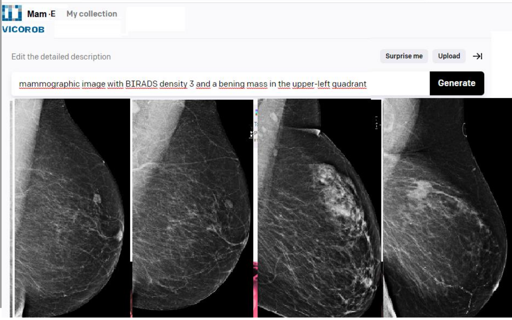

# Erasmus Mundus Joint Master's Degree in Medical Imaging and Applications (MAIA)
# Master Thesis: "Mam-E: Mammographic synthetic image generation with diffusion models"

------------------------------------------------------------------------------------------------------------------------------

## Author
- ### Ricardo Montoya del Ángel
## Supervisor
- ### Dr. Robert Martí Marly

------------------------------------------------------------------------------------------------------------------------------

## Abstract

This repository contains the code derived form the writting of the master thesis project on mammographic image generation using diffusion models.