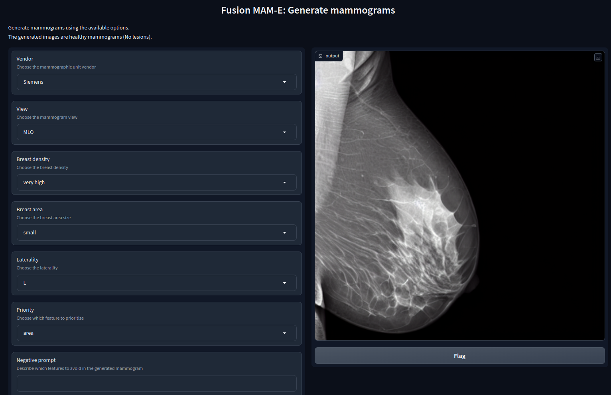

# MAM-E: Mammographic synthetic image generation with diffusion models

------------------------------------------------------------------------------------------------------------------------------
> ## Running GUI
>Access our GUI for the inference of the models [here](https://f07462107e6868080b.gradio.live/)!<br>
>>Note: The availability of the GUI is not guaranteed 24/7.

## Main contributors
- ### Ricardo Montoya-del-Angel
- ### Robert Martí

## Research group
- ### Computer Vision and Robotics Institute (ViCOROB) of the University of Girona (UdG)

------------------------------------------------------------------------------------------------------------------------------



This repository contains the code derived from the Master thesis project on mammographic image generation using diffusion models. This project is part of the final assessment to obtain the Joint Master's degree in Medical Imaging and Applications (MAIA) at the University of Girona (Spain), the University of Cassino and Southern Lazio (Italy) and the University of Bourgogne (France).

# Description
------------------------------------------------------------------------------------------------------------------------------
In this work, we propose exploring the use of diffusion models for the generation of high quality full-field digital mammograms using state-of-the-art conditional diffusion pipelines. Additionally, we propose using stable diffusion models for the inpainting of synthetic lesions on healthy mammograms. We introduce *MAM-E*, a pipeline of generative models for high quality mammography synthesis controlled by a text prompt and capable of generating synthetic lesions on specific sections of the breast.

# Main documentation
------------------------------------------------------------------------------------------------------------------------------
The paper of this project can be found here: [MAM-E: Mammographic Synthetic Image Generation with Diffusion Models](https://www.mdpi.com/1424-8220/24/7/2076).<br>

Additionally, the report of the project, the slides of the presentation and the poster can be found in the [documentation](https://github.com/Likalto4/diffusion-models_master/tree/main/documentation) folder.

# Set up the environment (upadted 2025)
------------------------------------------------------------------------------------------------------------------------------
To create the mame environment we suggest mamba/conda using our yaml file:

1. Create conda environment:

```bash 
mamba env create -f envs/requirements_mamba.yaml
mamba activate mame
```

This will create a conda environment named `mame`. Before creating it, make sure that the cuda version of pytorch is being installed.

2. After activating the environment, install the bitsandbytes library individually:

```bash
mamba install bitsandbytes -c conda-forge 
```

This is done because the bitsandbytes library may try to install the pytorch cpu version if included in the requirements file.

## Additional notes

You may also install all the libraries using other environment managers, like pip. Just open the yaml file, explore the libraries and install them using pip.
# Running the code
------------------------------------------------------------------------------------------------------------------------------

Here is a brief description on how to run an experiment for the "fusion model".

1. Go to the experiment folder:

```bash
cd experiments/with_prompt/fusion
```

2. Edit the configuration file to set the desired parameters. For example, you can change the number of epochs, the batch size, the learning rate, etc.
- It is important to define the data location and the results directory in the configuration file.
- For special configuration settings (e.g. xformer usage, wandb logging, etc.), refer to the corresponding documentation.

3. Run the experiment:
    
```bash
python fusion_prompt.py
```

Note: The fusion model using batch size of 16 (with variable graident accumulation steps), 512x512 image, with xformers activated, 8 bit adam, gradient checkpointing and fp16 mixed precision training, requires around 20GB of GPU memory.


# Repository structure
------------------------------------------------------------------------------------------------------------------------------

The repository is structured as follows:
- assessment: code for qualitative and quantitative assessment of the generated images.
- data (not included in the repository): contains the data used for training the models.
    - The training data location as well as the results directory are be defined in the configuration file.
    - This means you can have virtually any directory structure that you want for your data.
- dataset_analysis: code for the analysis of the dataset. This includes constructing the dataset metadata, saving png files, creating masks, prompt, etc.
- datasets_local: contains useful functions for the dataset creation.
- envs: contains the conda and pip environment files.
- experiments: contains the code for the main experiments. It is divided in several sections. The main ones are:: 
    - dreambooth: original code for the Dreambooth model.
    - inference: code for the inference of the models, including GradIO GUI implementations.
    - inpainting: for the inpainting experiments.
    - with_prompt: main SD and Dreambooth experiments.
- figures: contains the figures used in the README.
- generation (future work): for the use of synthetic images in the training of CAD systems.
- results (not included in the repository): contains the weights, pipeline configuration files and some logging files for the experiments. (The same information can be found in the Hugging Face repository of the first author).

# Citation

If you find this project useful, please consider citing it:

```
@Article{s24072076,
AUTHOR = {Montoya-del-Angel, Ricardo and Sam-Millan, Karla and Vilanova, Joan C. and Martí, Robert},
TITLE = {MAM-E: Mammographic Synthetic Image Generation with Diffusion Models},
JOURNAL = {Sensors},
VOLUME = {24},
YEAR = {2024},
NUMBER = {7},
ARTICLE-NUMBER = {2076},
URL = {https://www.mdpi.com/1424-8220/24/7/2076},
ISSN = {1424-8220},
DOI = {10.3390/s24072076}
}
```